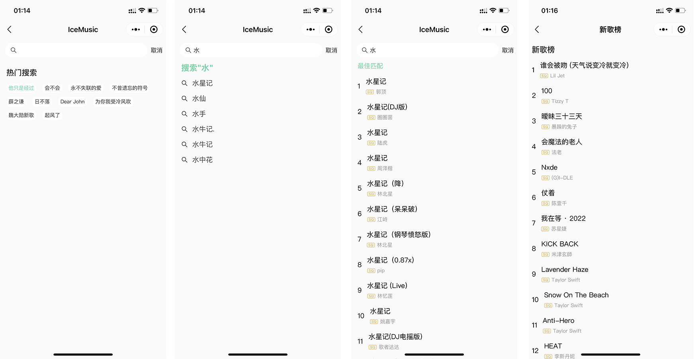
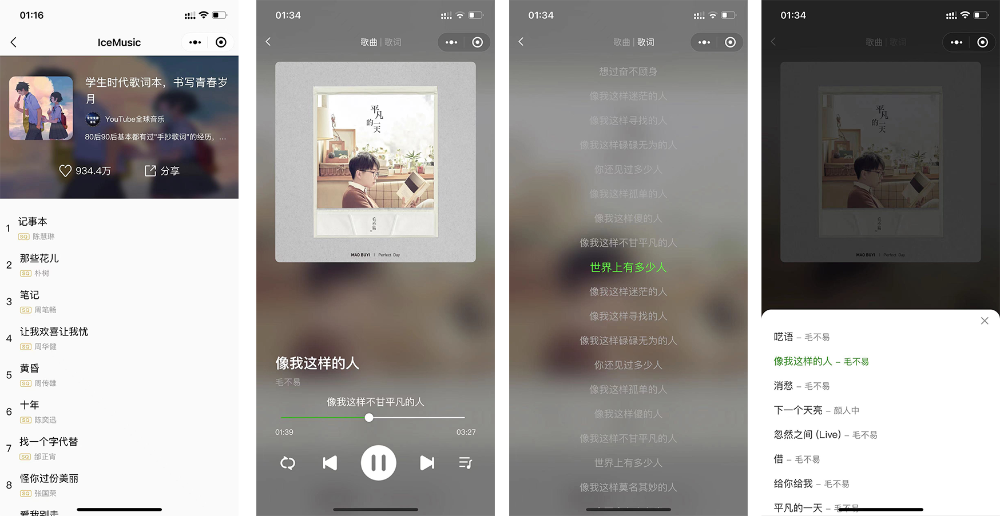

# 微信小程序 - iceMusic

## 1. 项目介绍

### 1.1 技术栈

微信小程序 + vant 组件库 + hy-event-store 状态管理库 + underscore

### 1.2 页面效果及功能介绍

- 效果展示

- 音乐首页

  - 轮播图展示
  - 列表滑动

- 视频列表

  - 下拉加载
  - 无限滚动

- 视频详情

  - 播放视频

- 搜索页面

  - 搜索联想
  - 搜索列表
  - 搜索热词

- 歌单列表

  - 数据共享

- 榜单列表

  - 数据共享

- 播放详情

  - 歌词展示
  - 歌词匹配
  - 上一首下一首
  - 播放模式 (随机/循环/列表)

### 1.3 项目亮点及难点

- 亮点
  1. 网络请求 api,进行二次封装，请求加载 loading 效果
  2. 性能优化，采用分包，包的大小缩小，50%左右
  3. 性能优化，多出使用的节流，缓解服务器压力
  4. 组件的合理化封装，多次复用
  5. 合理的管理歌曲列表的状态(数据), 请求一次多个页面进行共享
- 难点
  1. 播放歌曲页面，状态管理封装管理，其他地方只需要 dispatch
  2. 歌词进度匹配，对应的时间匹配对应的歌词
  3. 微信小程序 AudioContext，API 中的 CurrentTime 返回不准确，导致项目进度条产生 bug
